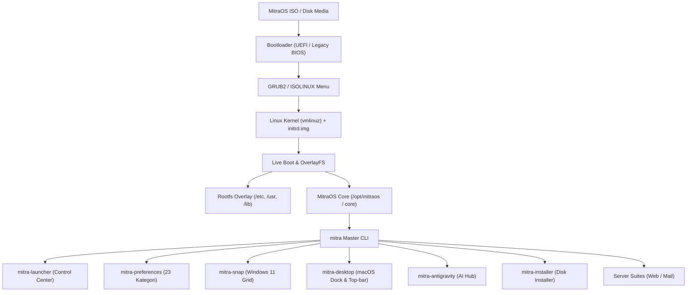

# Arsitektur Sistem MitraOS V.1

Dokumen ini menjelaskan rancangan arsitektur, alur boot, hierarki pustaka, dan modularitas sistem **MitraOS**.

---

## 1. Diagram Hierarki Sistem

---

## 2. Struktur Direktori Repositori

| Direktori | Deskripsi & Isi |
|-----------|-----------------|
| `assets/` | File media visual terorganisir: `branding/` (logo, icon), `wallpapers/` (wallpaper default), `ui/` (traffic lights, tombol jendela). |
| `boot/` | Konfigurasi dan biner booting: `grub/` (`grub.cfg`, `efi.img`), `isolinux/`, `efi/` (`BOOTX64.EFI`), `kernel/` (`vmlinuz`, `initrd.img`). |
| `core/` | Inti sistem: `bin/` (seluruh script eksekusi `mitra-*`), `lib/` (`mitra-globals`), `compat/` (wrapper shims `apollo-*`), `modules/` (kernel modules FAT/exFAT). |
| `rootfs/` | Overlay sistem berkas Debian: `/etc/os-release`, `/etc/fastfetch`, `/etc/bashrc.d`, service systemd, biner overlay `/usr/bin/`. |
| `packages/` | Katalog software: `apt/` (shim APT/DPKG), `manifests/` (`base-system.manifest`, `developer-suite.txt`, dll). |
| `build/` | Tooling re-mastering ISO: `build-iso.py`, `build-iso.ps1`, `build-iso.sh`, dan konfigurasi metadata. |
| `docs/` | Dokumentasi lengkap arsitektur, panduan perkakas, dan cara build. |

---

## 3. Pustaka Inti: `mitra-globals`

Pustaka `core/lib/mitra-globals` berfungsi sebagai fondasi bersama bagi seluruh program MitraOS:
- **Deteksi Hardware Dinamis**: Mendeteksi otomatis apakah komputer adalah Pentium 4 (32-bit i686), AMD/Intel 64-bit modern, ARM64 (Raspberry Pi/Orange Pi), atau Virtual Machine (KVM/Hyper-V/Proxmox).
- **Deteksi RAM Spesifikasi Rendah**: Menandai sistem jika RAM <= 1024 MB untuk mengaktifkan kompresi ZRAM ganda dan menonaktifkan efek berat.
- **Tema Visual Modern (NEWT_COLORS)**: Mengubah dialog TUI standar menjadi tampilan dark slate beraksen cyan dan amber.
- **Resolusi Path Cerdas**: Menemukan lokasi program secara dinamis tanpa bergantung pada satu path mutlak.
- **Lapisan Kompatibilitas Mundur**: Mendukung panggilan fungsi lama `G_APOLLO-*` dan variabel `APOLLO_*`.

---

## 4. Antarmuka Desktop & Window Management

- **MitraOS macOS Profile**:
  - Panel atas (Top Menu Bar) 32px untuk logo MitraOS, jam terpusat, dan status sistem.
  - Floating Centered Dock di bawah layar dengan animasi auto-hide.
  - Window buttons traffic light di kiri atas jendela (`assets/ui/btn_close.png`, `btn_min.png`, `btn_max.png`).
- **MitraOS Snap Layout**:
  - Beroperasi pada level window manager (`wmctrl` / `xdotool`).
  - Menghitung resolusi aktif dan menerapkan layout grid presisi (50/50, 66/33, Quad 25%, 3-Kolom, dan Center Focus) dengan margin dan celah (gap) simetris.

---

## 5. Fondasi Paket Esensial

Daftar 45+ paket fondasi sistem didefinisikan pada `packages/manifests/base-system.manifest`, mencakup:
- **Shells**: `sh`, `bash`, `dash`
- **Core Utilities**: `coreutils`, `util-linux`, `findutils`, `grep`, `sed`, `gawk`, `diffutils`, `procps`, `psmisc`
- **Package Management**: `apt`, `apt-utils`, `dpkg`, `debconf`, `ca-certificates`, `gnupg`, `gnupg-utils`, `gpgv`, `debian-archive-keyring`
- **Networking**: `curl`, `wget`, `iproute2`, `iputils-ping`, `isc-dhcp-client`
- **Archiving**: `tar`, `gzip`, `bzip2`, `xz-utils`, `zstd`
- **User & Privileges**: `sudo`, `passwd`, `login`, `adduser`, `addgroup`
- **Init & Daemons**: `systemd`, `systemd-sysv`, `systemd-resolved`, `udev`, `dbus`
- **Storage**: `mount`, `e2fsprogs`, `fdisk`, `parted`, `lsblk`, `blkid`
- **Editor**: `nano`
